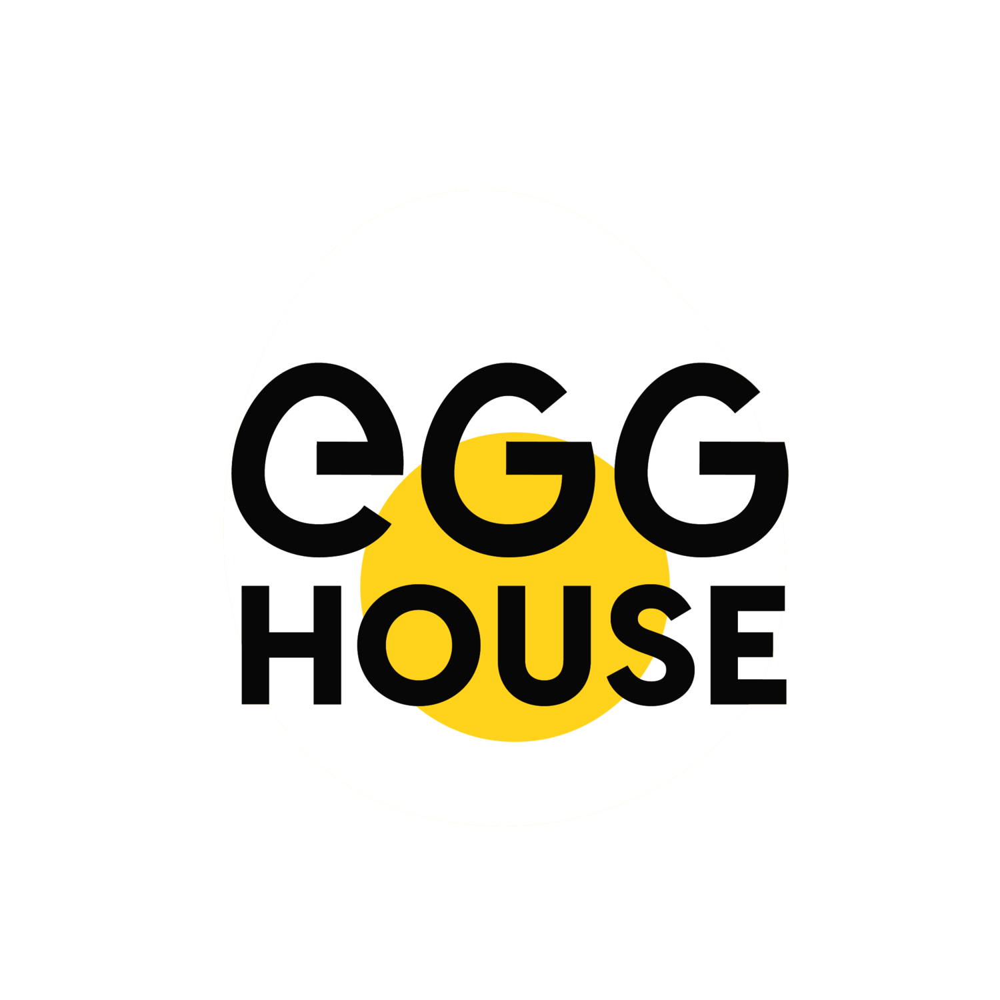

# EGG HOUSE

## Mira que zarpado esta EGG  : https://youtu.be/sMQEHbJfd0o   

Este es un front de practica con HTML &amp; css . Hicimos esto para despues sumarlo al back y hacer el proyecto final.
<b>codeado por [Ale Laparra](https://github.com/laparraalejandro/egg-house.git)</b>

## Instalacion y Setup

1. Para clonar el repositorio, simplemente use el siguiente comando de GIT:  _`git clone https://github.com/laparraalejandro/egg-house.git`_
2.  Puede ver una demo del proyecto ingresando al siguiente enlace: [Proyecto en vivo](https://egg-house.netlify.app/)_

### 👍 DIVIERTANSE 👍
El Chacho

